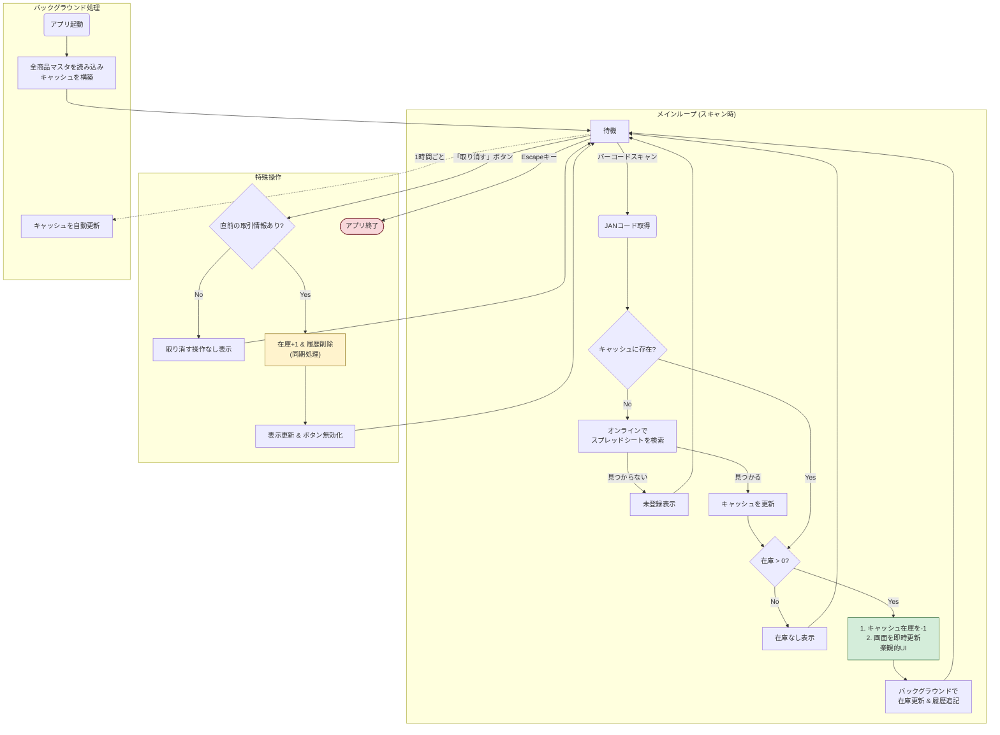

# 🍫 研究室 購買部在庫管理システム

## 1. 概要 (Overview) 📖
このプロジェクトは、Raspberry Piを専用端末（キオスク端末）として利用し、研究室のお菓子や備品の在庫をリアルタイムで管理するためのシステムです。バーコードをスキャンするだけの簡単な操作で、Googleスプレッドシート上の在庫情報が自動で更新されます。


---
## 2. 主な機能 (Features) ✨
- **リアルタイム在庫連携**: Googleスプレッドシートを利用し、誰でも最新の在庫状況を確認できます。
- **バーコードによる簡単操作**: 商品のバーコードをスキャンするだけで、在庫数が自動で減ります。
- **高速な応答速度 (楽観的UI)**: スキャンした瞬間に画面が更新されるため、ネットワークの遅延を感じさせません。
- **取り消し機能**: 万が一、商品を間違えてスキャンしても、ボタン一つで直前の操作を安全に取り消せます。
- **キャッシュと自動更新**: アプリ起動時に商品情報を一括で読み込むことで高速な検索を実現。さらに、1時間ごとに自動で情報を更新するため、常にデータが最新の状態に保たれます。
- **キオスクモード**: Raspberry Piの電源を入れると、ネットワーク接続を待ってから自動でアプリが全画面で起動します。

---
## 3. システム構成図 (Workflow) ⚙️


---
## 4. セットアップ手順 🛠️
このシステムをゼロからセットアップするための手順です。

### ステップ1：Googleスプレッドシートの準備 📊
1.  PCのブラウザでGoogleドライブを開き、新規にスプレッドシートを作成して、ファイル名を `購買部在庫管理システム` にします。
2.  ファイル内に、以下の構成と名前で2つのシートを**正確に**作成します。

   シート名: `商品マスタ`
| 列 | A | B | C | D | E | F | G |
| :--- | :--- | :--- | :--- | :--- | :--- | :--- | :--- |
| **ヘッダー** | 商品名 | 分類 | 価格 | 在庫 | URL | JAN | 在庫金額 |

シート名: `購入履歴`
| 列 | A | B | C | D | E |
| :--- | :--- | :--- | :--- | :--- | :--- |
| **ヘッダー** | 購入日時 | JANコード | 商品名 | 数量 | 合計金額 |

### ステップ2：Google APIの設定 🔑
1.  PCのブラウザで[Google Cloud Platform](https://console.cloud.google.com/)にアクセスし、新しいプロジェクトを作成します。
2.  APIライブラリで`Google Drive API`と`Google Sheets API`を検索し、両方を有効化します。
3.  「認証情報」メニューから「サービスアカウント」を作成し、キー（**JSONファイル**）をダウンロードします。
4.  上記で作成したスプレッドシートの「共有」設定を開き、ダウンロードしたJSONキーファイル内に記載されている`client_email`のアドレスを**「編集者」**として追加します。

### ステップ3：Raspberry Piへのファイル配置 📂
1.  ラズパイ上で、プロジェクト用のフォルダを作成します。（例: `~/kiosk-system`）
2.  このフォルダに、GitHubリポジトリからダウンロードした以下の**4つのファイル**を配置します。
    -   `main.py` （アプリケーション本体）
    -   `start_kiosk.sh` （起動用スクリプト）
    -   `.gitignore` （Git管理用ファイル）
    -   **ステップ2**でダウンロードした**認証キーのJSONファイル**。（例: `your-credentials.json`）

### ステップ4：依存ライブラリのインストール 📦
ラズパイのターミナルを開き、以下のコマンドでPythonライブラリをインストールします。
```bash
pip3 install gspread google-auth-oauthlib
```

### ステップ5：起動スクリプトの設定 ✍️
1.  `start_kiosk.sh` をテキストエディタで開き、**2箇所のパス**がご自身の環境と一致しているか確認・修正します。
    -   `export KASHI_KIOSK_CREDS_PATH` の行： 認証JSONファイルの**フルパス**に修正。
    -   `cd` の行： プロジェクトフォルダの**フルパス**に修正。

2.  スクリプトに実行権限を付与します。
    ```bash
    chmod +x start_kiosk.sh
    ```

### ステップ6：自動起動（キオスク化）の設定 🚀
ラズパイの電源を入れたらアプリが自動で起動するように設定します。

1.  `autostart`フォルダがなければ作成します。
    ```bash
    mkdir -p ~/.config/autostart
    ```
2.  自動起動設定ファイル（`.desktop`ファイル）を作成します。
    ```bash
    nano ~/.config/autostart/kiosk.desktop
    ```
3.  エディタが開いたら、以下の内容を書き込み、`Exec=`のパスが`start_kiosk.sh`のフルパスと一致しているか確認して保存します。
    ```ini
    [Desktop Entry]
    Type=Application
    Name=KashiKiosk
    Exec=/home/pi/kiosk-system/start_kiosk.sh
    Terminal=false
    ```
    *(注: 上記パスは一例です。ご自身のユーザー名やフォルダ名に合わせてください)*

### ステップ7：再起動 ✅
ターミナルで `sudo reboot` を実行して再起動します。デスクトップ起動後、アプリが自動で立ち上がれば成功です。

---
## 5. 使い方 👨‍💻
1.  商品のバーコードをスキャナにかざします。
2.  画面に結果が即座に表示されるのを確認します。
3.  間違えた場合は、「取り消す」ボタンを押します。
4.  アプリを終了したい場合は、キーボードの`Esc`キーを押します。

---
## 6. トラブルシューティング 🆘
-   **Q: 画面に「接続エラー」と表示される。**
    -   A: ラズパイがWi-FiやLANに正しく接続されているか確認してください。また、JSONキーファイルが正しいか、スプレッドシートの共有設定が正しいかを見直してください。
-   **Q: スキャンしても反応がない。**
    -   A: バーコードリーダーがUSBポートにしっかり接続されているか確認してください。一度、テキストエディタなどを開いて、そこにスキャンできるか試すと、リーダー自体の動作確認ができます。
-   **Q: 電源を入れてもアプリが起動しない。**
    -   A: `start_kiosk.sh`に実行権限（`chmod +x`）が付与されているか、`.desktop` ファイル内の`Exec=`のパスが正しいかを確認してください。
